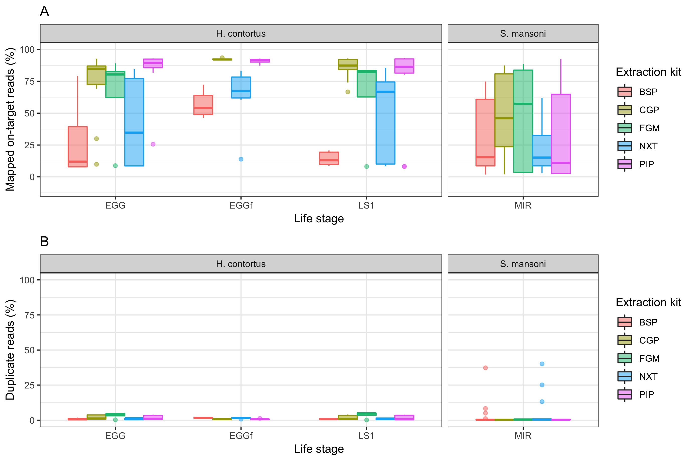

# DNA extraction and whole genome sequencing of single egg and larval samples from helminths

## Table of contents
0. [Project overview](#overview)
1. [Project setup](#setup)
2. [Mapping](#mapping)
3. [Analysis](#analysis)


## 00 - Project overview

The aim of this work is to test a number of low input DNA extraction approaches for individual helminth samples stored on FTA cards, followed by low input library preparation without WGA, and whole-genome sequencing.


## 01 - Project setup <a name="setup"></a>
### Setup a working environment for the analysis.
In my work environment, it is: ${WORKING_DIR}

``` shell

mkdir ${HOME}/HELMINTH_EXTRACTION_WGS
cd ${HOME}/HELMINTH_EXTRACTION_WGS
WORKING_DIR=${PWD}

# make working directories
mkdir 00_SCRIPTS 01_REFERENCES 02_RAWDATA 03_MAPPING 04_ANALYSIS
```

### Reference genomes
Get the reference genomes for mapping
```
cd 01_REFERENCES

# a_canium
wget ftp://ftp.ebi.ac.uk/pub/databases/wormbase/parasite/releases/WBPS12/species/ancylostoma_caninum/PRJNA72585/ancylostoma_caninum.PRJNA72585.WBPS12.genomic.fa.gz

# d_medinensis
wget ftp://ftp.ebi.ac.uk/pub/databases/wormbase/parasite/releases/WBPS12/species/dracunculus_medinensis/PRJEB500/dracunculus_medinensis.PRJEB500.WBPS12.genomic.fa.gz

# h_contortus
wget ftp://ftp.ebi.ac.uk/pub/databases/wormbase/parasite/releases/WBPS12/species/haemonchus_contortus/PRJEB506/haemonchus_contortus.PRJEB506.WBPS12.genomic.fa.gz

# s_mansoni
wget ftp://ftp.ebi.ac.uk/pub/databases/wormbase/parasite/releases/WBPS12/species/schistosoma_mansoni/PRJEA36577/schistosoma_mansoni.PRJEA36577.WBPS12.genomic.fa.gz

# a_dissimilis - note, we dont have a reference genome for this species, so using ascaris_lumbricoides
wget ftp://ftp.ebi.ac.uk/pub/databases/wormbase/parasite/releases/WBPS12/species/ascaris_lumbricoides/PRJEB4950/ascaris_lumbricoides.PRJEB4950.WBPS12.genomic.fa.gz

# d_immitis
wget ftp://ftp.ebi.ac.uk/pub/databases/wormbase/parasite/releases/WBPS12/species/dirofilaria_immitis/PRJEB1797/dirofilaria_immitis.PRJEB1797.WBPS12.genomic.fa.gz

# s_stercoralis
wget ftp://ftp.ebi.ac.uk/pub/databases/wormbase/parasite/releases/WBPS12/species/strongyloides_stercoralis/PRJEB528/strongyloides_stercoralis.PRJEB528.WBPS12.genomic.fa.gz

# t_muris
wget ftp://ftp.ebi.ac.uk/pub/databases/wormbase/parasite/releases/WBPS12/species/trichuris_muris/PRJEB126/trichuris_muris.PRJEB126.WBPS12.genomic.fa.gz

# unzip
for i in *.gz; do gunzip ${i} ;  done

```

### Sample and lane list
I use this format for a few different steps in my workflows. It is simple a tab delimited file containing the sample name, and the sequencing lane ID. Samples with more
than a single sequencing lane will be represented twice, but overall, each line of the file will be unique. At Sanger, we have a "pathfind" script that can be looped through to retrieve the IDs, and then these can be renames as appropriate.

```shell
#Example is:
DM_LS1_NXT_LCM_001      26924_3#1
DM_LS1_NXT_LCM_002      26924_3#2
DM_LS1_NXT_LCM_003      26924_3#3
DM_LS1_NXT_LCM_004      26924_3#4
DM_LS1_NXT_LCM_005      26924_3#5
DM_LS1_NXT_LCM_006      26924_3#6
DM_LS1_NXT_LCM_007      26924_3#7
DM_LS1_NXT_LCM_008      26924_3#8
DM_LS1_NXT_LCM_009      26924_3#9
DM_LS1_NXT_LCM_010      26924_3#10
```

The actual "samples_lanes.list" used in this study is located here: XXXX

${WORKING_DIR}/02_RAWDATA/samples_lanes.list

Need to generate a per species sample_lane list for mapping, simply becasue they need to be mapped to different reference genomes. Otherwise, would have used the orginal file.
```shell
# use grep to extract lines associated with each species
for i in DM AC HC SM AD DI SS TM; do
          grep ^${i} samples_lanes.list > ${i}_samples_lanes.list;
     done
```


### Raw data
Get the raw sequencing data for the analysis. All data will be available for download from ENA, links to which are provided in the metadata table in which the samples are described.
Be aware the the steps in the next section may not work exactly as stated, as it is based on how I retrieved the Sanger environment. However,
at the end of this subsection, it should be pretty clear how the data needs to be formatted for the mapping steps.

```shell
# getting data form iRODs
kinit  # this requires a password

icd /seq/28536
ils | grep "28536.*.cram$" | grep -v "phix" | while read -r data; do iget /seq/28536/$data ./; done &

icd /seq/25934
ils | grep "25934.*.cram$" | grep -v "phix" | while read -r data; do iget /seq/25934/$data ./; done &


icd /seq/26790
ils | grep "26790.*.cram$" | grep -v "phix" | while read -r data; do iget /seq/26790/$data ./; done &

# get the old "chip" and "nextera" data - it is in pathfind
for i in 21094_1#1 21094_1#2 21094_1#3 21094_1#4 21094_1#5 21094_1#6 21033_1#1 21033_1#2 21033_1#3 21033_1#4 21033_1#5 21033_1#6 ; do pathfind -t lane -i ${i} --symlink ./ --filetype fastq ; done &

# get the GW data
while read NAME; do pathfind -t lane -i ${NAME} --symlink ./ --filetype fastq ; done < gw.list

# get the SM data
while read NAME LANE; do pathfind -t lane -i ${LANE} --symlink ./ --filetype fastq ; done < sm.list

#--- convert crams to fastq, and then gzip
for i in *cram; do samtools view -ub --threads 4 ${i} | samtools sort -n - | samtools fastq -1 ${i%.cram}_1.fastq.gz -2 ${i%.cram}_2.fastq.gz - ; done

rm *.cram

```


## 02 - Mapping to the genome <a name="mapping"></a>
Mapping uses a wrapper script called "run_bwamem_splitter" to map reads using bwa mem to the genome. It speeds up the process by splitting reads into smaller chunks, maps them individually, and then merges the mapping files.

It is quite specific to the Sanger environment - ie, samtools, bwa, and that it automatically submits jobs to out LSF system - and probably wont work anywhere else.

```shell
cd ${WORKING_DIR}/03_MAPPING

screen

while read NAME LANE; do \
~sd21/bash_scripts/run_bwamem_splitter ${NAME}_${LANE} \
${WORKING_DIR}/01_REFERENCES/dracunculus_medinensis.PRJEB500.WBPS12.genomic.fa \
${WORKING_DIR}/02_RAWDATA/${LANE}_1.fastq.gz \
${WORKING_DIR}/02_RAWDATA/${LANE}_2.fastq.gz; \
done < ${WORKING_DIR}/02_RAWDATA/DM_samples_lanes.list &

sleep 5

while read NAME LANE; do \
~sd21/bash_scripts/run_bwamem_splitter ${NAME}_${LANE} \
${WORKING_DIR}/01_REFERENCES/ancylostoma_caninum.PRJNA72585.WBPS12.genomic.fa \
${WORKING_DIR}/02_RAWDATA/${LANE}_1.fastq.gz \
${WORKING_DIR}/02_RAWDATA/${LANE}_2.fastq.gz; \
done < ${WORKING_DIR}/02_RAWDATA/AC_samples_lanes.list &

sleep 5

while read NAME LANE; do \
~sd21/bash_scripts/run_bwamem_splitter ${NAME}_${LANE} \
${WORKING_DIR}/01_REFERENCES/haemonchus_contortus.PRJEB506.WBPS12.genomic.fa \
${WORKING_DIR}/02_RAWDATA/${LANE}_1.fastq.gz \
${WORKING_DIR}/02_RAWDATA/${LANE}_2.fastq.gz; \
done < ${WORKING_DIR}/02_RAWDATA/HC_samples_lanes.list &

sleep 5

/

sleep 5

while read NAME LANE; do \
~sd21/bash_scripts/run_bwamem_splitter ${NAME}_${LANE} \
${WORKING_DIR}/01_REFERENCES/ascaris_lumbricoides.PRJEB4950.WBPS12.genomic.fa \
${WORKING_DIR}/02_RAWDATA/${LANE}_1.fastq.gz \
${WORKING_DIR}/02_RAWDATA/${LANE}_2.fastq.gz; \
done < ${WORKING_DIR}/02_RAWDATA/AD_samples_lanes.list &

sleep 5

while read NAME LANE; do \
~sd21/bash_scripts/run_bwamem_splitter ${NAME}_${LANE} \
${WORKING_DIR}/01_REFERENCES/dirofilaria_immitis.PRJEB1797.WBPS12.genomic.fa \
${WORKING_DIR}/02_RAWDATA/${LANE}_1.fastq.gz \
${WORKING_DIR}/02_RAWDATA/${LANE}_2.fastq.gz; \
done < ${WORKING_DIR}/02_RAWDATA/DI_samples_lanes.list &

sleep 5

while read NAME LANE; do \
~sd21/bash_scripts/run_bwamem_splitter ${NAME}_${LANE} \
${WORKING_DIR}/01_REFERENCES/strongyloides_stercoralis.PRJEB528.WBPS12.genomic.fa \
${WORKING_DIR}/02_RAWDATA/${LANE}_1.fastq.gz \
${WORKING_DIR}/02_RAWDATA/${LANE}_2.fastq.gz; \
done < ${WORKING_DIR}/02_RAWDATA/SS_samples_lanes.list &

sleep 5

while read NAME LANE; do \
~sd21/bash_scripts/run_bwamem_splitter ${NAME}_${LANE} \
${WORKING_DIR}/01_REFERENCES/trichuris_muris.PRJEB126.WBPS12.genomic.fa \
${WORKING_DIR}/02_RAWDATA/${LANE}_1.fastq.gz \
${WORKING_DIR}/02_RAWDATA/${LANE}_2.fastq.gz; \
done < ${WORKING_DIR}/02_RAWDATA/TM_samples_lanes.list &

# check to see there are flagstat data per mapping. If not, print name
for i in *out; do
          if [ ! -f "${i}/${i%_bwasplitter_out}.merged.sorted.marked.flagstat" ]; then
                    echo ${i};
               fi;
          done

```


## 03 - Analysis <a name="analysis"></a>

The run_bwamem_splitter script automatically determiend s flagstat and bamstats for the bam files in each mapping job. We'll summarise all of that informaiton using multiqc

```shell
cd ${WORKING_DIR}/04_ANALYSIS

# run Multiqc
multiqc ${WORKING_DIR}/03_MAPPING

# extract relevant information from the multiqc output, combining it with some variables based on the metadata
echo -e "sample_name\tspecies\tlifestage\textraction\tlibrary" > categories.list

cut -f1 multiqc_data/multiqc_bamtools_stats.txt  |\
  sed '1d' |\
  awk -F'[_]' '{print $1"_"$2"_"$3"_"$4"_"$5,$1,$2,$3,$4}' OFS="\t" >> categories.list

paste categories.list multiqc_data/multiqc_bamtools_stats.txt > multiqc_bamtools_stats.w_categories.txt
```


### Generate some plots in R
The commands below generate two figures, the first to highlight the differences in the extraction approaches trialled, and the second, to show the variation between the different species tested. The key metrics will the the proportion of reads mapped to the genome, and the proportion of reads that are identified as duplicates.

```R  
R-3.5.0
# load required libraries
library(ggplot2)
library(patchwork)
library(dplyr)
library(psych)
# read in data
data <- read.table("multiqc_bamtools_stats.w_categories.txt", header=T, na.strings="", comment.char="")

# descriptive statistics

describeBy(data,group=data$extraction)
describeBy(data,list(data$extraction,data$species),digits=2)

# Figure 1
# subset the data to extract the H.contortus and S.mansoni data. We only really tested these species with mutliple kits
hcsm_data <- data[data$species=="SM" | data$species=="HC" ,]

mapplot <- ggplot(hcsm_data,aes(x=lifestage,y=mapped_reads_pct,col=extraction,fill=extraction))+
               geom_boxplot(position = position_dodge(preserve = "single"),alpha=0.5)+
               #geom_point(position = position_dodge(preserve = "single"))+
               ylim(0,100)+
               labs(x="Life stage",y="Mapped Read (% of total reads)",title="Library preparation test: Mapped reads")+
               theme_bw()+
               facet_grid(.~species,drop = TRUE,scales = "free", space = "free")


dupplot <- ggplot(hcsm_data,aes(x=lifestage,y=duplicates_pct,col=extraction,fill=extraction))+
               geom_boxplot(position = position_dodge(preserve = "single"),alpha=0.5)+
               #geom_point(position=position_dodge(width = 0.75))+
               ylim(0,100)+
               labs(x="Life stage",y="Duplicate Read (% of total reads)",title="Library preparation test: Duplicate reads")+
               theme_bw()+
               facet_grid(.~species,drop = TRUE,scales = "free", space = "free")

# combine plots with patchwork, and save output
mapplot + dupplot + plot_layout(ncol=1)
ggsave("Figure1_stats_by_prep_hc_sm.pdf",useDingbats=FALSE)
ggsave("Figure1_stats_by_prep_hc_sm.png")

# Figure 2
# subset data to collect on the CGP libraries. However, D.medinesis was prepped with nexttek, so want to show that too and compare. Will make a not in the writeup that this was in fact different.
data_CGP <- data[data$extraction=="CGP",]
data_DM <- data[data$extraction=="NXT" & data$species=="DM",]
data_species<- bind_rows(data_CGP, data_DM)

mapplot <- ggplot(data_species,aes(x=species,y=mapped_reads_pct,col=lifestage,fill=lifestage))+
               geom_boxplot(position = position_dodge(preserve = "single"),alpha=0.5)+
               #geom_point(position=position_dodge(width = 0.75),size=1)+
               ylim(0,100)+
               labs(x="Species",y="Mapped Read (% of total reads)",title="Species test: Mapped reads")+
               theme_bw()+
               facet_grid(.~species,drop = TRUE,scales = "free", space = "free")


dupplot <- ggplot(data_species,aes(x=species,y=duplicates_pct,col=lifestage,fill=lifestage))+
               geom_boxplot(position = position_dodge(preserve = "single"),alpha=0.5)+
               #geom_point(position=position_dodge(width = 0.75))+
               ylim(0,100)+
               labs(x="Species",y="Mapped Read (% of total reads)",title="Species test: Duplicate reads")+
               theme_bw()+
               facet_grid(.~species,drop = TRUE,scales = "free", space = "free")

# combine plots with patchwork, and save output
mapplot + dupplot + plot_layout(ncol=1)
ggsave("Figure2_Stats_by_species.pdf",useDingbats=FALSE)
ggsave("Figure2_Stats_by_species.png")
```


- Copy to local dir - run this from local machine
```shell
scp sd21@pcs5.internal.sanger.ac.uk:/nfs/users/nfs_s/sd21/lustre118_link/hc/HELMINTH_EXTRACTION_WGS/04_ANALYSIS/Figure* ~/Documents/workbook/helminth_extraction_wgs_test/04_analysis
```

## Figures

Figure 1. Comparison of library preparation approaches on *H. contortus* Egg, Egg(frozen), and L1 stages, and *S. mansoni* miracidia. The top plot presents the percentage of reads that mapped to each reference genome, and the bottom plot presents the proportion of duplicate reads identified. Boxplots are coloured by the library preparation approach used.


Figure 2. Comparison of library preparation from multiple life stages of 8 helminth species. All libraries were prepared with the CGP approach, except for *D. medinensis*, which was prepared with Nexttec that we present for comparison. As in Figure 1, the top plot presents the percentage of reads that mapped to each reference genome, and the bottom plot presents the proportion of duplicate reads identified. Boxplots are coloured by the life stage assayed.


```shell
# need to doublecheck why I have put this here...???
while read NAME LANE; do pf qc --id ${LANE} --type lane >> tmp ; done < samples_lanes.list

while read NAME; do name=$(echo $NAME | cut -f16 -d"/") ; data=$(cat $NAME | head -n3 | tail -n1 | cut -f1) ; printf "$name\t$data\n"; done < tmp
```


# Revision of data and figures for helminth extraction manuscript

## Setup the working environment and import some data
The data used is provides as supplementary table 2 of the manuscript, and can be found in the 04_analysis folder. Providing the working directory
is set correctly / is in the relevant place, all commands should be reproducible throughout.

```R
setwd("Documents/workbook/helminth_extraction_wgs_test")

# libraries
library(ggplot2)
library(patchwork)

# get data
data <- read.delim("02_data/metadata_and_results_tableS2.tsv", header=T)


# subset data
#--- for figure 1
hc <- data[data$species_ID=="HC",]
sm <- data[data$species_ID=="SM",]
hc_sm <-rbind(hc,sm)

#--- for figure 2
cgp <- data[data$extraction_kit_ID=="CGP",]

#--- for Supplement
dm <- data[data$species_ID=="DM",]

# generate some labels to replace coded names
species.labels <- c("A. caninum","A. dissimilis","D. immitis","D. medinensis","H. contortus", "S. mansoni","S. stercoralis","T. muris" )
names(species.labels) <- c("AC","AD","DI","DM","HC","SM","SS","TM")

lifestage.labels <- c("Egg","Egg (bleached)", "Egg (frozen)", "Free living adult", "L1", "L3","Microfilaria","Miracidia")
names(lifestage.labels) <- c("EGG","EGGb", "EGGf", "FL", "LS1","LS3", "MFL", "MIR")
```

## Generate new figures
I have reworked the figures to included data that was in the supplement, but not really featured in the main text. This is in response to some of the review comments
and I think by including them, it does strengthen the interpretations somewhat. As a result, there are three new main text figures, and three supplementary figures.

Main text
- Figure 1 - sequencing library concentration per extraction kit for H. contortus and S. mansoni
- Figure 2 - A. sequencing library concentration vs mapping x extraction kit. B.  sequencing library concentration vs mapping x proportion of contaminants.
- Figure 3 - A. sequencing library concentration vs mapping x extraction kit for all species using CGP kit. B.  sequencing library concentration vs mapping x proportion of contaminants for all species using CGP kit.

Supplementary Data
- Figure S1 - old figure 1 showing mapping boxplots
- Figure S2 - old figure 2 showing mapping boxplots for all species
- Figure S3 - new figure showing data for D. mediniensis

Figures will get written to the 04_analysis folder.


``` R

# New figure 1

hcsm_conc_boxplot<-ggplot(hc_sm,aes(extraction_kit_ID,library_qc_ng_ul,fill=lifestage_ID))+
  geom_boxplot(position = position_dodge(preserve = "single"),alpha=0.5)+
  ylim(0,12)+
  labs(x="Extraction kit ID",
       y="Sequencing library concentration (ng/ul)",
       fill="Lifestage")+
  theme_bw()+
  facet_grid(.~species_ID,drop = TRUE,scales = "free", space = "free",labeller = labeller(species_ID = species.labels))
hcsm_conc_boxplot

ggsave("04_analysis/Figure_1.pdf",useDingbats=FALSE)
ggsave("04_analysis/Figure_1.png")
```


```R
# new figure 2
#--- plot mapped vs library concentration x lifestage (shape) x kit (colour)
conc_v_mapped_x_kit_plot<-ggplot(hc_sm,aes(log10(library_qc_ng_ul),mapped_reads_percent,col=extraction_kit_ID,shape=lifestage_ID))+
  geom_point()+
  geom_vline(xintercept=log10(0.25),col="grey60",linetype='dashed')+
  ylim(0,100)+
  labs(title="A",
       x="Sequencing library concentration (log10[ng/ul])",
       y="Mapped on-target reads (%)",
       col="Extraction kit",
       shape="Life stage")+
  theme_bw()+
  facet_grid(.~species_ID,labeller = labeller(species_ID = species.labels))

#--- plot mapped vs library concentration x lifestage (shape) x contamination (colour)
conc_v_mapped_x_contam_plot<-ggplot(hc_sm, aes(log10(library_qc_ng_ul),mapped_reads_percent,col=100-kraken_unassigned_percent,shape=lifestage_ID))+
  geom_point()+
  geom_vline(xintercept=log10(0.25),col="grey60",linetype='dashed')+
  ylim(0,100)+
  labs(title="B",
       x="Sequencing library concentration (log10[ng/ul])",
       y="Mapped on-target reads (%)",
       col="Putative \ncontamination (%)",
       shape="Life stage")+
  guides(shape = FALSE)+ # remove the lifestage shapes in the 2nd plots, as it is already present in the first part of the figure
  theme_bw()+
  scale_color_viridis_c()+
  facet_grid(.~species_ID,labeller = labeller(species_ID = species.labels))

#--- patchwork to bring the two plots together
conc_v_mapped_x_kit_plot +
  conc_v_mapped_x_contam_plot +
  plot_layout(ncol = 1)

ggsave("04_analysis/Figure_2.pdf",useDingbats=FALSE)
ggsave("04_analysis/Figure_2.png")
```


```R
# New figure 3

cgp <- data[data$extraction_kit_ID=="CGP",]

conc_v_mapped_x_species_lifestage <- ggplot(cgp,aes(log10(library_qc_ng_ul),mapped_reads_percent,col=lifestage_ID))+
  geom_point()+
  ylim(0,100)+
  labs(title="A",
       x="Sequencing library concentration (log10[ng/ul])",
       y="Mapped on-target reads (%)",
       col="Extraction kit",
       shape="Life stage")+
  theme_bw()+
  geom_vline(xintercept=log10(0.25),col="grey60",linetype='dashed')+
  facet_grid(.~species_ID,labeller = labeller(species_ID = species.labels))

conc_v_mapped_x_species_contam <- ggplot(cgp, aes(log10(library_qc_ng_ul),mapped_reads_percent,col=100-kraken_unassigned_percent))+
  geom_point()+
  ylim(0,100)+
  labs(title="B",
       x="Sequencing library concentration (log10[ng/ul])",
       y="Mapped on-target reads (%)",
       col="Putative \ncontamination (%)",
       shape="Life stage")+
  theme_bw()+scale_color_viridis_c()+
  geom_vline(xintercept=log10(0.25),col="grey60",linetype='dashed')+
  facet_grid(.~species_ID,labeller = labeller(species_ID = species.labels))+
  guides(shape = FALSE)

#--- patchwork to bring the two plots together
conc_v_mapped_x_species_lifestage +
  conc_v_mapped_x_species_contam +  
  plot_layout(ncol=1)

ggsave("04_analysis/Figure_3.pdf",useDingbats=FALSE)
ggsave("04_analysis/Figure_3.png")
```


```R
# Supplementary Figures
# New supplementary figure 1 - old figure 1
#--- box plot showing mapped reads per lifestage per extraction kit for H. contortus and S. mansoni
mapped_kit_lifestage <- ggplot(hc_sm,aes(x=lifestage_ID,y=mapped_reads_percent,col=extraction_kit_ID,fill=extraction_kit_ID))+
  geom_boxplot(position = position_dodge(preserve = "single"),alpha=0.5)+
  ylim(-10,100)+
  labs(title="A",
       x="Life stage",
       y="Mapped on-target reads (%)",
       fill="Extraction kit")+
  guides(col = FALSE)+
  theme_bw()+
  facet_grid(.~species_ID,drop = TRUE,scales = "free", space = "free",labeller = labeller(species_ID = species.labels))

#--- box plot showing duplicate reads per lifestage per extraction kit for H. contortus and S. mansoni  
duplicates_kit_lifestage <- ggplot(hc_sm,aes(x=lifestage_ID,y=duplicate_reads_percent,col=extraction_kit_ID,fill=extraction_kit_ID))+
  geom_boxplot(position = position_dodge(preserve = "single"),alpha=0.5)+
  ylim(0,100)+
  labs(title="B",
       x="Life stage",
       y="Mapped on-target reads (%)",
       fill="Extraction kit")+
  theme_bw()+
  facet_grid(.~species_ID,drop = TRUE,scales = "free", space = "free",labeller = labeller(species_ID = species.labels))+
  guides(col = FALSE)

#--- patchwork to bring the two plots together
mapped_kit_lifestage +
  duplicates_kit_lifestage +
  plot_layout(ncol=1)

ggsave("04_analysis/Figure_S1.pdf",useDingbats=FALSE)
ggsave("04_analysis/Figure_S1.png")
```



```R
# New supplementary figure 2 - old figure 2
#--- box plot showing mapped reads per lifestage per species
mapped_species_lifestage <- ggplot(cgp,aes(x=species_ID,y=mapped_reads_percent,col=lifestage_ID,fill=lifestage_ID))+
  geom_boxplot(position = position_dodge(preserve = "single"),alpha=0.5)+
  ylim(0,100)+
  labs(title="A",
       x="Species",
       y="Mapped on-target reads (%)",
       fill="Life stage")+
  theme_bw()+
  facet_grid(.~species_ID, drop = TRUE, scales = "free", space = "free", labeller = labeller(species_ID = species.labels))+
  guides(col = FALSE)

#--- box plot showing duplicate reads per lifestage per species
mapped_species_duplicates <- ggplot(cgp,aes(x=species_ID,y=duplicate_reads_percent,col=lifestage_ID,fill=lifestage_ID))+
  geom_boxplot(position = position_dodge(preserve = "single"),alpha=0.5)+
  ylim(0,100)+
  labs(title="B",
       x="Species",
       y="Duplicate reads (%)",
       fill="Life stage")+
  theme_bw()+
  facet_grid(.~species_ID, drop = TRUE, scales = "free", space = "free", labeller = labeller(species_ID = species.labels))+
  guides(col = FALSE)

#--- patchwork to bring the two plots together
mapped_species_lifestage +
  mapped_species_duplicates +
  plot_layout(ncol=1)

ggsave("04_analysis/Figure_S2.pdf",useDingbats=FALSE)
ggsave("04_analysis/Figure_S2.png")
```


```R
# New supplementary figure 3 - dm
#--- box plot showing mapped reads per lifestage per extraction kit for H. contortus and S. mansoni
dm_mapped_kit_lifestage <- ggplot(dm,aes(x=lifestage_ID,y=mapped_reads_percent,col=extraction_kit_ID,fill=extraction_kit_ID))+
  geom_boxplot(position = position_dodge(preserve = "single"),alpha=0.5)+
  ylim(-10,100)+
  labs(title="A",
       x="Life stage",
       y="Mapped on-target reads (%)",
       fill="Extraction kit")+
  guides(col = FALSE)+
  theme_bw()+
  facet_grid(.~species_ID,drop = TRUE,scales = "free", space = "free",labeller = labeller(species_ID = species.labels))

#--- box plot showing duplicate reads per lifestage per extraction kit for H. contortus and S. mansoni  
dm_duplicates_kit_lifestage <- ggplot(dm,aes(x=lifestage_ID,y=duplicate_reads_percent,col=extraction_kit_ID,fill=extraction_kit_ID))+
  geom_boxplot(position = position_dodge(preserve = "single"),alpha=0.5)+
  ylim(0,100)+
  labs(title="B",
       x="Life stage",
       y="Mapped on-target reads (%)",
       fill="Extraction kit")+
  theme_bw()+
  facet_grid(.~species_ID,drop = TRUE,scales = "free", space = "free",labeller = labeller(species_ID = species.labels))+
  guides(col = FALSE)

dm_conc_v_mapped_x_species_lifestage <- ggplot(dm,aes(log10(library_qc_ng_ul),mapped_reads_percent,col=duplicate_reads_percent))+
  geom_point()+
  ylim(0,100)+
  labs(title="C",
       x="Sequencing library concentration (log10[ng/ul])",
       y="Mapped on-target reads (%)",
       col="Duplicate reads (%)")+
  theme_bw()+scale_color_viridis_c()+
  geom_vline(xintercept=log10(0.25),col="grey60",linetype='dashed')+
  facet_grid(.~species_ID,labeller = labeller(species_ID = species.labels))

dm_conc_v_mapped_x_species_contam <- ggplot(dm, aes(log10(library_qc_ng_ul),mapped_reads_percent,col=100-kraken_unassigned_percent))+
  geom_point()+
  ylim(0,100)+
  labs(title="D",
       x="Sequencing library concentration (log10[ng/ul])",
       y="Mapped on-target reads (%)",
       col="Putative \ncontamination (%)",
       shape="Life stage")+
  theme_bw()+scale_color_viridis_c()+
  geom_vline(xintercept=log10(0.25),col="grey60",linetype='dashed')+
  facet_grid(.~species_ID,labeller = labeller(species_ID = species.labels))+
  guides(shape = FALSE)

#--- patchwork to bring the two plots together
dm_mapped_kit_lifestage +
  dm_duplicates_kit_lifestage +
  dm_conc_v_mapped_x_species_lifestage +
  dm_conc_v_mapped_x_species_contam +
  plot_layout(ncol=2)

ggsave("04_analysis/Figure_S3.pdf",useDingbats=FALSE)
ggsave("04_analysis/Figure_S3.png")
```

